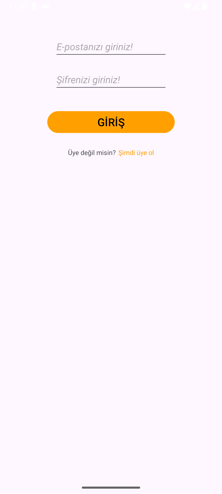
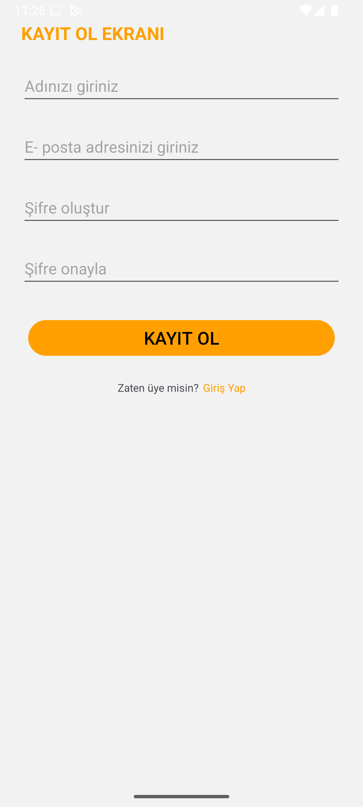
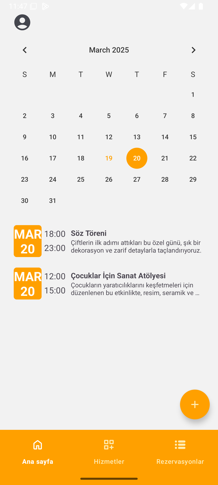
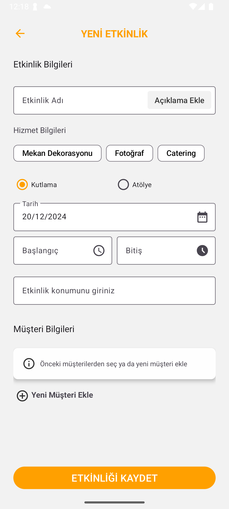
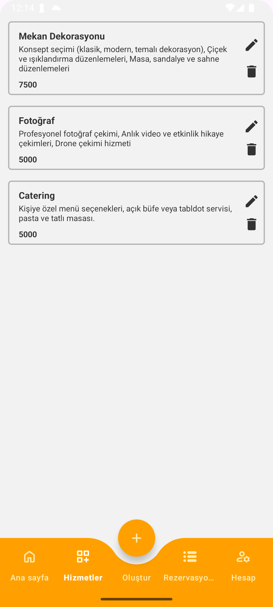
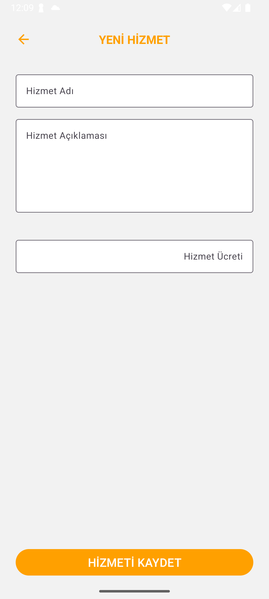
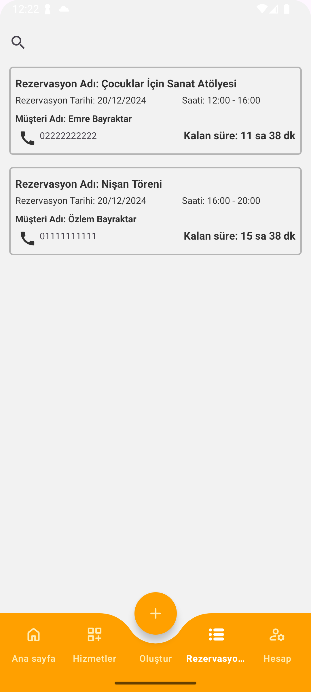

# EventFlow - Etkinlik Yönetim Uygulaması

EventFlow, organizasyonel etkinliklerin (nişan, söz, workshop vb.) planlanmasını ve yönetilmesini kolaylaştırmak için geliştirilmiş bir mobil uygulamadır.
Küçük işletmelerin ve bireylerin etkinliklerini etkili bir şekilde organize etmelerine olanak tanır.
Kullanıcılar etkinlik detaylarını (başlık, açıklama, tarih, saat, hzimet, müşteri) ekleyebilir, etkinliklerini düzenleyebilir veya liste halinde görüntüleyebilir.
Tüm etkinliklerini görüntüleyebilir veya takvimden seçtiği bir günün etkinliklerini düzenleyebilir.  
Firebase Firestore tabanlı altyapısı sayesinde gerçek zamanlı veri yönetimini destekler ve kullanıcı yetkilendirme işlemlerini güvenli bir şekilde gerçekleştirir.

## Öne Çıkan Özellikler

- Kullanıcı girişi ve kayıt işlemleri (Firebase Authentication)
- Etkinlik ekleme, düzenleme ve silme işlevleri
- Etkinliklerin tarih, saat gibi detaylarla listelenmesi
- Rezervasyonların tümünün listelenmesi ve arama yapılması

## Geliştirilmesi Planlanan Özellikler

- Account yönetimi
- Tarihi yaklaşan etkinliklerin hatırlatılması
- Konum özelliği
- logout

## Mimari

Proje mimarisi olarak **MVVM (Model-View-ViewModel)** kullanılmıştır.  

MVVM, kodu modüler bir şekilde düzenlemeye olanak tanır. Model, View ve ViewModel'in ayrı tutulması, kodu daha düzenli ve sürdürülebilir hale getirir.  
**Model:** Veri tabanı, ağ istekleri veya local depolama ile ilgili işlemleri içerir. 
**View:** Aktiviteler, fragmentler aracılığı ile görsel bileşenleri içerir. 
**ViewModel:** Model ve View arasında bir bağlantı sağlar. Kullanıcı arayüzüyle ilgili işlemleri içerir ve View'i doğrudan etkilemeden, Model'den gelen verilere erişim sağlar. 

## Kullanılan Teknolojiler

- Kotlin
- MVVM
- Hilt
- Coroutines
- Firebase Authentication
- Firebase FireStore
- LiveData
- UseCase
- Navigation Components
- Data Binding
- Repository
- Fragment

## Ekran Görüntüleri

   
   

